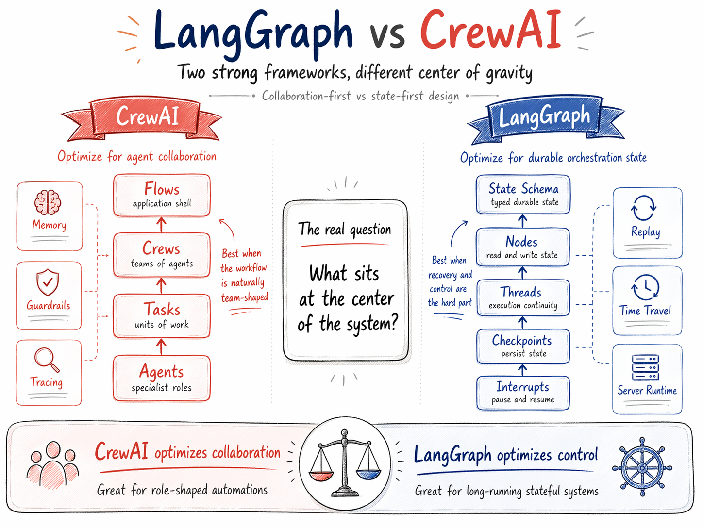
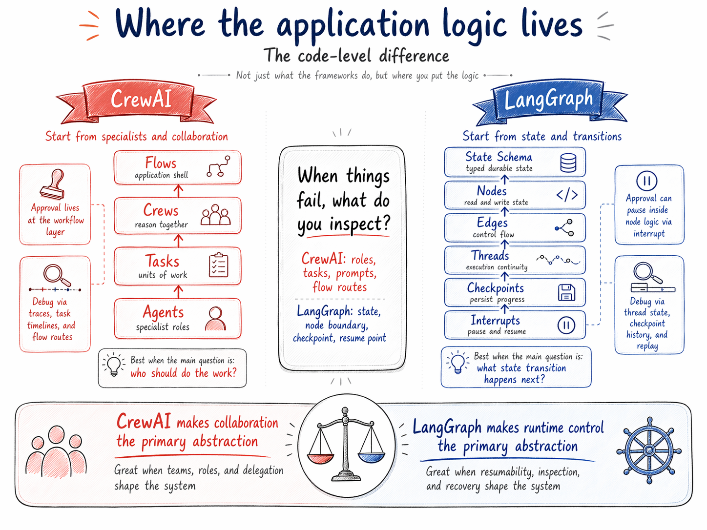
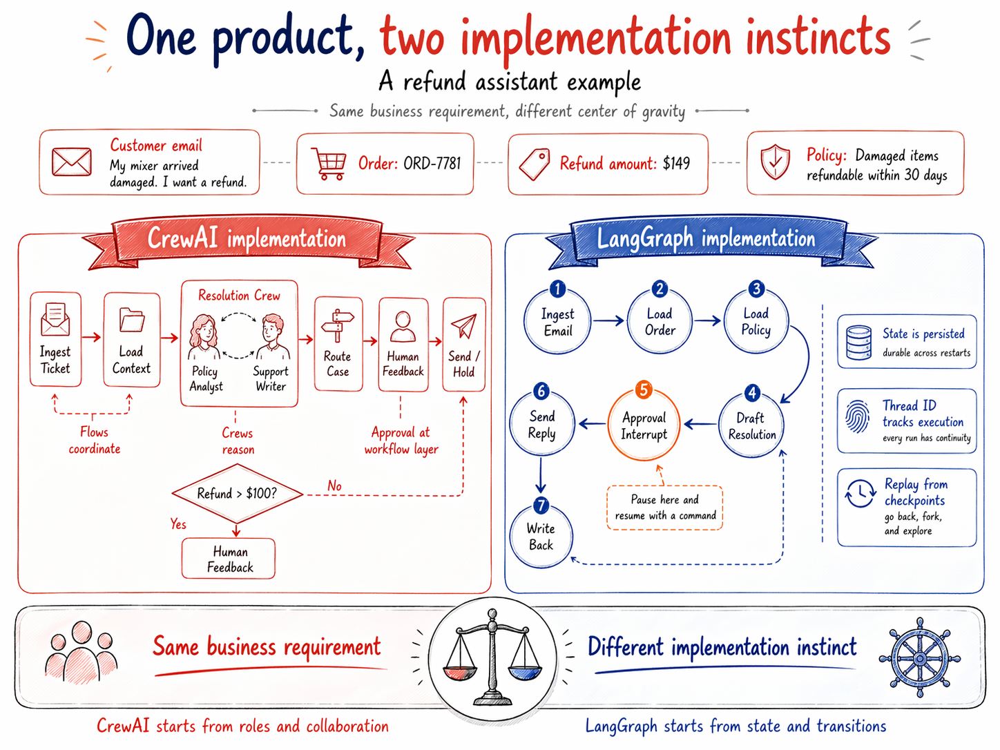
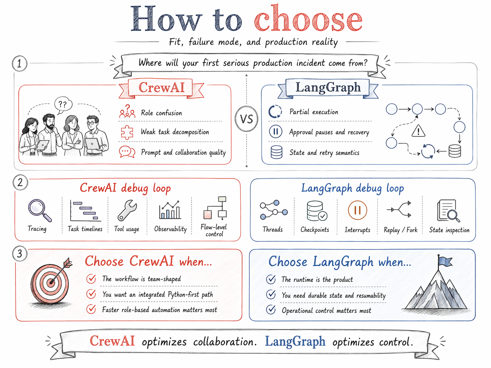

# LangGraph vs CrewAI vs DSPy

Three frameworks, three theories of what an LM application actually is. CrewAI thinks the unit is a team. LangGraph thinks the unit is a state machine. DSPy thinks the unit is a program you compile. They are not interchangeable, and the bench below makes that visible: the choice changes how many tokens you send, how the model responds, how variable your tail latency is, and how much of the completion the model burns on internal reasoning before it gets to the answer.



*Figure 1 shows the CrewAI vs LangGraph polarity. DSPy sits on a third axis: it is what produces the reliable prompt each node or agent ends up executing. Treat this comparison as triangular, not linear.*

## The Three Centers of Gravity

Every LM framework forces one question to the center. The one it picks shapes everything downstream: schemas, tests, failure modes, incident response.

**CrewAI is about who does the work.** The primitives are Agent, Task, Crew, and Flow. Flows are the backbone; Crews live inside them as units of collaborative work. Human approval in the OSS package uses `Task(human_input=True)` or Flow-level state checks; the `@human_feedback` decorator shown in many tutorials is CrewAI Enterprise (1.8.0+), not the OSS pip package, which trips people up. Memory is a single `Memory` API with scope, importance, and recency scoring. AMP is the managed platform on top. The instinct is organizational: specialists with roles, wrapped in workflow control. On the bench it shows up as a hardcoded ReAct envelope (`Thought:` / `Final Answer:`) that adds about 156 tokens to every call, and the highest latency variance of the three (5.87s stdev on Flash).

**LangGraph is about what state the system is in and what runs next.** The primitives are StateGraph, nodes, edges, threads, and checkpointers. Persistence is not a feature, it is the spine. Human approval is `interrupt()` inside a node; the runtime freezes the thread and resumes when you invoke with a `Command`. Time travel, fork, replay, and superstep-boundary recovery fall out of the checkpoint model. Runs in Python and JavaScript. The instinct is infrastructural. On the bench it adds zero tokens to the prompt (the framework does not touch what you write) and adds the lowest pure-Python overhead, around 113ms across two LLM calls.

**DSPy is about the program as something you compile.** The primitives are Signature (typed IO contract), Module (ChainOfThought, ReAct, Predict), and Optimizer (MIPROv2, BootstrapFewShot, GEPA). You write declarative code, DSPy compiles it into the actual prompt, few-shot demos, and sometimes fine-tuned weights. Treating "the prompt" as the output of a compile pass, instead of something a human hand-tunes, is the move. GEPA (Agrawal et al., ICLR 2026 Oral, arXiv 2507.19457) uses reflective Pareto-frontier evolution and beats MIPROv2 by about 10 points while outperforming GRPO with up to 35x fewer rollouts. That is a different regime, when scale lines up. GEPA on MATH burns thousands of LM calls with a sharp metric. The compile section below shows what happens when scale does not line up: on a 50-ticket classifier, BootstrapFewShot lands inside sampling noise of a hand-written 4-shot prompt. The "different regime" claim depends on optimizer and trainset; do not transfer the MATH headline to a small classifier. On the bench DSPy shows up as a structural ChatAdapter format that pulls reasoning emission down by about 25 percentage points versus the other two on Gemini 2.5 Flash, and roughly 4.5x more Python function calls per ticket.



*Figure 2 captures the CrewAI and LangGraph split. Overlay DSPy on both: it changes what goes into each specialist's prompt or each graph node's LM call.*

## Who Actually Ships This

Glossy case-study pages are cheap. Engineering-grade deployments with named metrics are not. Here is what each framework has actually shipped.

**LangGraph in production.** Read every number in this section as vendor or customer-stated unless I say otherwise. Almost none of them are independently audited. Klarna's customer-support assistant handles 85M active users with a reported ~80% cut in resolution time, but that 80% figure originally tied to Klarna's pre-LangGraph deployment on OpenAI; the LangChain blog now credits the current iteration as LangGraph-based, which I read as a multi-stage stack rather than a clean before-and-after. LinkedIn's hierarchical recruiting agent and Replit's multi-agent coding copilot with mid-flight human-in-the-loop both ship on LangGraph, per the LangChain blog. Elastic runs security-agent networks on it for real-time threat detection, per their own case study. AppFolio's property-manager copilot reports more than 10 hours saved per week and roughly doubled decision accuracy, AppFolio's number, single customer. LangGraph hit 1.0 in late 2025.

**Uber as a mini-teardown** (Uber engineering blog + LLMOps DB write-up; figures are Uber-stated). Uber wraps LangGraph in an internal framework called "Lang Effect" integrated with their build system, IDE tooling, and observability. On top of Lang Effect they shipped Validator (IDE-integrated code-quality flagging with hybrid LLM + static analysis), AutoCover (automated test generation with coverage analysis and mutation testing), UReview (code-review enhancement), Uber Assistant Builder, and Genie (conversational UI for Picasso workflows). Stated scale: 5,000 engineers served, hundreds of millions of lines of code covered, thousands of daily fix interactions, 10% lift in developer-platform coverage, ~21,000 developer hours saved via AutoCover, and up to 100 parallel test iterations at 2-3x the speed of comparable tools. The load-bearing architectural pattern: domain-expert agents instead of generalist ones, hybrid composition of LLM agents with deterministic components (static linting, build tooling), and reusable primitives like build-system agents shared across multiple products. The pattern is what to copy; the metrics are what Uber says they achieved.

**CrewAI in production.** CrewAI's own 2026 survey of 500 execs at $100M+ companies reports 81% of respondents at "scaling or fully deployed" agent adoption. The framework claims Fortune-500 penetration around 60%, 2B trailing-year executions, and named deployments at PwC, IBM, Capgemini, and NVIDIA. All vendor-reported, none independently audited; treat the headline numbers accordingly. Community case studies skew toward business-process automation: insurance-claims triage, client-feedback pipelines, marketing-content workflows, legal-document review crews. CrewAI's pitch is less "novel agent architecture" and more "opinionated path from specialist decomposition to a managed runtime." Take the architecture for what it is and ignore the survey.

**DSPy in production.** Same provenance caveat: the names below come from DSPy's own use-cases page. JetBlue (chatbot applications), Replit (code-diff synthesis), Databricks (LM judges, RAG, internal classification), Moody's (RAG and LLM-as-judge in finance), JPMC, VMware, Sephora, Zoro UK (structured shopping), PingCAP (knowledge-graph construction), Salomatic (medical-report enrichment), Normal Computing (English chip specs into formal languages), Haize Labs (red-teaming), Plastic Labs (Honcho memory), RadiantLogic (text-to-SQL), Procure.FYI. None of them use DSPy as the orchestration runtime. The pattern is the same shape every time: DSPy produces the prompts and demonstrations, something else runs them. Databricks publishes one such pipeline: DSPy compiles the high-value LM calls, MLflow 3.0 versions and traces them, Unity Catalog governs the artifacts, and Mosaic AI Agent Framework (or LangGraph, or anything else) is the runtime.

## Where Each One Breaks

Feature lists are boring. Failure modes are where choice matters.

**CrewAI breaks when the hard problem is not specialist decomposition.** Checkpointing for crews, flows, and agents exists in docs but is early-release. If your first serious incident is partial state, exact-semantics recovery, or cross-node idempotency, you are leaning on the newest layer of the stack. The abstraction is also sticky: once you commit to the crew/role vocabulary, problems that are actually sequential state machines get forced into awkward specialist theater. Second concrete tax: 2-second cold import (measured locally) matters in serverless or cold-start-heavy environments. Third: the OSS HITL story is weaker than the docs suggest, because the polished `@human_feedback` decorator sits behind Enterprise.

**LangGraph breaks at exactly the spot low-level runtimes always break.** Nothing prevents you from over-modeling the state schema, writing non-idempotent nodes that survive replay incorrectly, or producing a graph too dense to reason about. Documentation is fragmented across multiple patterns. Error messages are frequently unhelpful. The import surface is heavy (LangChain pulls in a lot). None of this matters in a demo and all of it matters at month four. What the Uber case shows is that mature teams tend to wrap LangGraph, not use it naked.

**DSPy breaks when you treat it as an agent framework.** It has `dspy.ReAct` and you can build agent loops inside it, but execution is not transparent the way LangGraph threads are. Tool-call traces, mid-flight pauses, resumable state, and incident inspection are not the native vocabulary. The framework also assumes you can produce a metric. If you cannot score a trajectory, the optimizers have nothing to optimize and you are back to hand-tuning strings. And the compile step is not free: GEPA on a non-trivial program against a decent-size trainset can burn thousands of LM calls before it converges. Skip DSPy if your app is genuinely conversational and open-ended without clear success criteria.

## One Product, Three Code Paths

Same business requirement: email refund assistant that reads a ticket, decides policy fit, drafts a reply, pauses for approval above a threshold, sends. Below are the essentials of each implementation. Full runnable code is in `bench/impl_*.py` and the accompanying notebook.

### LangGraph: state machine first

```python
def node_approval(state):
    if state["requested_refund"] <= 100:
        return Command(goto="send", update={"approved": True})
    approved = interrupt({
        "question": "Approve refund reply?",
        "ticket_id": state["ticket_id"],
        "draft_reply": state["draft_reply"],
    })
    return Command(
        update={"approved": bool(approved)},
        goto="send" if approved else END,
    )

graph = builder.compile(checkpointer=InMemorySaver())
config = {"configurable": {"thread_id": "refund-T-1024"}}
graph.invoke(ticket, config=config)                     # pauses at interrupt
graph.invoke(Command(resume=True), config=config)       # resumes from checkpoint
```

The runtime contract is the code. You can point at exactly where state changes, where the pause is, and what resumes. That is why this shape ages well under production stress.

### CrewAI: roles inside a flow

```python
class RefundFlow(Flow[RefundState]):
    @start()
    def ingest(self):
        pass

    @listen(ingest)
    def run_crew(self):
        policy = Agent(role="Refund Policy Analyst", goal="decide", llm=llm, ...)
        writer = Agent(role="Customer Support Writer", goal="draft", llm=llm, ...)
        triage = Task(description="...", agent=policy)
        draft = Task(description="...", agent=writer, context=[triage])
        crew = Crew(agents=[policy, writer], tasks=[triage, draft], process=Process.sequential)
        result = crew.kickoff(inputs={"email": self.state.email_text, "policy": self.state.policy_summary})
        self.state.draft_reply = str(result)

    @listen(run_crew)
    def finalize(self):
        self.state.status = "held_for_review" if self.state.requested_refund > 100 else "sent"
```

The code describes an organization before it describes a runtime. Approval is a state-level branch in OSS; CrewAI Enterprise exposes `@human_feedback` as a decorator with richer UX. For production HITL on the OSS path, prefer `Task(human_input=True)` at the task level or an explicit state check.

### DSPy: optimize the program, not the prompt

```python
class Triage(dspy.Signature):
    """Decide refund eligibility given ticket and policy."""
    email_text: str = dspy.InputField()
    policy: str = dspy.InputField()
    eligible: bool = dspy.OutputField()
    rationale: str = dspy.OutputField()

class RefundProgram(dspy.Module):
    def __init__(self):
        super().__init__()
        self.triage = dspy.ChainOfThought(Triage)
        self.write = dspy.ChainOfThought(Reply)

    def forward(self, email_text, policy, requested_refund):
        t = self.triage(email_text=email_text, policy=policy)
        if not t.eligible:
            return dspy.Prediction(reply=None, status="held_for_manual_followup")
        r = self.write(email_text=email_text, rationale=t.rationale)
        status = "sent" if requested_refund <= 100 else "held_for_review"
        return dspy.Prediction(reply=r.reply, status=status)

# The step that justifies DSPy's existence:
optimizer = dspy.GEPA(metric=refund_quality_metric, auto="medium")
compiled = optimizer.compile(RefundProgram(), trainset=trainset)
compiled.save("refund_program_compiled.json")
```

Note what is missing: no threads, no checkpointer, no interrupts, no crews. DSPy's output is the compiled program. You then run that inside whatever orchestrator actually handles the refund workflow, typically a LangGraph node, a CrewAI task, or a plain service.



*Figure 3 shows two of the three implementation paths. Mentally add a third layer where the prompt each node or agent executes is itself a compiled DSPy artifact.*

## What 900 Runs Show

The bench ran each implementation against 100 unique refund tickets on three Gemini Flash variants. Dataset covers 10 issue types (damaged, defective, wrong-item, late, missing-parts, incompatible, quality, change-of-mind, warranty, sizing), 4 length buckets (5 to 79 words), 5 customer tones (neutral, frustrated, calm, confused, angry), 5 refund-amount buckets ($5 to $600), and 3 policy-fit categories (clear-yes 30%, clear-no 50%, ambiguous 20%). Identical seed, identical ticket body per framework. Temperature 0. Per-framework code in `bench/impl_*.py`. Dataset: `bench/tickets_100.json`. Raw runs in `results/bench_<model>.json`.

Three Gemini variants by design. Gemini 2.5 Flash (the larger reasoning-emitting Flash tier) emits a `output_token_details.reasoning` field that lands inside `completion_tokens`. Gemini 2.5 Flash-Lite is the same generation at the smaller non-reasoning tier. Gemini 3.1 Flash-Lite Preview is the next-generation small tier; the non-Lite `gemini-3.1-flash` text model is not yet exposed in the public API as of April 2026 (only `gemini-3.1-flash-image-preview`, image-only, and `gemini-3.1-flash-tts-preview`, audio-only). Running all three decouples *generation* (2.5 vs 3.1) from *tier* (Flash vs Flash-Lite) from *reasoning emission* (Flash only). That separation matters because, as the data below shows, the dominant variable is tier, not generation.

### Latency, with confidence intervals

Means with 95% t-CI; tail percentiles with non-parametric bootstrap 95% CI (1000 resamples). Source: `results/analysis_v2.md`.

| Model | Framework | Mean | 95% CI | Median | p95 | p95 95% CI | p99 | p99 95% CI |
|---|---|---|---|---|---|---|---|---|
| 2.5 Flash      | LangGraph | 6.99 | [6.37, 7.60] | 5.80 | 14.03 | [10.16, 17.23] | 19.11 | [14.03, 21.82] |
| 2.5 Flash      | CrewAI    | 7.28 | [6.13, 8.44] | 5.76 | 14.50 | [8.77, 28.56]  | 41.24 | [14.50, 43.08] |
| 2.5 Flash      | DSPy      | 4.37 | [3.98, 4.77] | 3.39 | 8.49  | [7.52, 9.11]   | 10.68 | [8.49, 11.21]  |
| 2.5 Flash-Lite | LangGraph | 2.12 | [2.05, 2.18] | 2.05 | 2.61  | [2.44, 3.07]   | 3.17  | [2.61, 4.23]   |
| 2.5 Flash-Lite | CrewAI    | 2.71 | [2.61, 2.81] | 2.60 | 3.59  | [3.26, 3.84]   | 4.14  | [3.59, 5.50]   |
| 2.5 Flash-Lite | DSPy      | 1.83 | [1.67, 1.99] | 1.54 | 3.44  | [3.02, 3.88]   | 3.88  | [3.44, 4.19]   |
| 3.1 Flash-Lite | LangGraph | 2.16 | [2.04, 2.28] | 1.96 | 3.46  | [3.05, 4.25]   | 4.40  | [3.46, 4.57]   |
| 3.1 Flash-Lite | CrewAI    | 2.27 | [2.17, 2.38] | 2.13 | 3.03  | [2.86, 3.61]   | 4.56  | [3.03, 5.21]   |
| 3.1 Flash-Lite | DSPy      | 1.71 | [1.56, 1.86] | 1.38 | 2.93  | [2.56, 3.31]   | 3.68  | [2.93, 5.62]   |

The CIs make visible what point estimates hide.

First, on 2.5 Flash, CrewAI mean [6.13, 8.44] and LangGraph mean [6.37, 7.60] **overlap**. The "CrewAI is slower than LangGraph on Flash" claim is not statistically supported at this n. DSPy [3.98, 4.77] is cleanly separated from both.

Second, on 2.5 Flash CrewAI p99 = 41.24s with bootstrap CI [14.50, 43.08] overlapping LangGraph's p99 CI [14.03, 21.82]. p95 also overlaps. CrewAI is not categorically slower at the tail; it is more variable (stdev 5.87s vs LangGraph's 3.11s). Picked up again in "Five Stories the Bench Tells" below.

Third, on the two Lite-tier models, all three frameworks have tight, separated CIs. DSPy's mean is significantly below both LangGraph and CrewAI on 2.5-Lite and 3.1-Lite (no CI overlap). CrewAI is significantly above LangGraph on 2.5-Lite (2.71 [2.61, 2.81] vs 2.12 [2.05, 2.18]). On 3.1-Lite, CrewAI vs LangGraph overlap (2.27 [2.17, 2.38] vs 2.16 [2.04, 2.28]).

### Tier vs generation, isolated

Same-tier comparison across generations (LG numbers shown; same shape for the others):

| Variant | LG mean | LG p99 | LG mean tokens |
|---|---|---|---|
| 2.5 Flash      (large, reasoning)   | 6.99s | 19.11s | 1086 |
| 2.5 Flash-Lite (small, no reasoning) | 2.12s | 3.17s  | 262  |
| 3.1 Flash-Lite (next-gen small)     | 2.16s | 4.40s  | 281  |

The 2.5-Lite to 3.1-Lite delta within the small tier is a few tens of milliseconds and 19 tokens: essentially noise. The 2.5 Flash to 2.5-Lite delta within the same generation is 4.87s mean and 824 tokens. **Tier (with its reasoning-emission setting) is the dominant variable**, not generation. Article framings like "2.5 vs 3.1" are misleading on this workload: what changed when you "upgraded" was the tier-level reasoning budget.

### Tokens per ticket

| Model | Framework | Prompt | Completion | Total | Median | stdev | Completion/Prompt |
|---|---|---|---|---|---|---|---|
| 2.5 Flash      | LangGraph | 201 | 884 | 1086 | 877  | 576  | 4.39 |
| 2.5 Flash      | CrewAI    | 502 | 950 | 1452 | 1180 | 1166 | 1.89 |
| 2.5 Flash      | DSPy      | 367 | 486 | 853  | 704  | 605  | 1.32 |
| 2.5 Flash-Lite | LangGraph | 198 | 64  | 262  | 249  | 62   | 0.32 |
| 2.5 Flash-Lite | CrewAI    | 504 | 228 | 732  | 723  | 104  | 0.45 |
| 2.5 Flash-Lite | DSPy      | 359 | 152 | 510  | 459  | 294  | 0.42 |
| 3.1 Flash-Lite | LangGraph | 203 | 78  | 281  | 268  | 66   | 0.38 |
| 3.1 Flash-Lite | CrewAI    | 511 | 114 | 626  | 606  | 68   | 0.22 |
| 3.1 Flash-Lite | DSPy      | 383 | 156 | 539  | 450  | 372  | 0.41 |

Prompt-token columns are model-invariant (within ±10 tokens noise from tokenization differences). They report the framework template cost and nothing else: LangGraph ~200, DSPy ~370, CrewAI ~505. That is +170 tokens for DSPy and +305 tokens for CrewAI per LLM call vs LangGraph's "raw user message".

### Cost in dollars

Gemini API list pricing (April 2026): 2.5 Flash $0.30 input / $2.50 output per 1M; 2.5 Flash-Lite $0.10 input / $0.40 output per 1M. 3.1 Flash-Lite Preview pricing has not been announced; numbers below use 2.5-Lite as proxy and should be treated as approximate.

| Model | Framework | Mean cents/ticket | Median cents/ticket | $ per 1k tickets |
|---|---|---|---|---|
| 2.5 Flash      | LangGraph | 0.227 | 0.170 | $2.27 |
| 2.5 Flash      | CrewAI    | 0.253 | 0.180 | $2.53 |
| 2.5 Flash      | DSPy      | 0.133 | 0.108 | $1.33 |
| 2.5 Flash-Lite | LangGraph | 0.0045 | 0.0044 | $0.05 |
| 2.5 Flash-Lite | CrewAI    | 0.0142 | 0.0139 | $0.14 |
| 2.5 Flash-Lite | DSPy      | 0.0097 | 0.0087 | $0.10 |
| 3.1 Flash-Lite | LangGraph | 0.0051 | 0.0050 | $0.05 |
| 3.1 Flash-Lite | CrewAI    | 0.0097 | 0.0095 | $0.10 |
| 3.1 Flash-Lite | DSPy      | 0.0101 | 0.0087 | $0.10 |

The Flash-to-Lite tier change cuts cost 25-50x. Within Lite, the framework gap is 2-3x (CrewAI 2.7x DSPy on 2.5-Lite). On Flash, the framework gap is 1.9x. For a workload pricing 1M tickets per month, swapping frameworks on Flash saves about $1,200/month; switching tiers saves $2,400/month even if you stay on the most expensive framework. Tier matters more.

### Framework overhead, fixed prompt

To isolate framework overhead from ticket variability, a separate probe runs one hardcoded question through each framework (`bench/probe_overhead.py`), and a second probe captures the actual byte-level messages each framework sends (`bench/inspect_messages.py`).

| Framework | Latency (2.5 Flash) | Prompt tokens | Completion tokens | Delta vs raw prompt |
|---|---|---|---|---|
| raw HTTP (LangChain client) | 3.04s | 26  | 279 | baseline |
| LangGraph (1-node graph)    | 2.89s | 26  | 279 | +0      |
| CrewAI (1 agent, 1 task)    | 2.00s | 182 | 118 | +156    |
| DSPy (`Predict` signature)  | 1.78s | 160 | 90  | +134    |

The prompts captured verbatim, tokenized with Gemini's `countTokens` API:

```text
LANGGRAPH (30 tokens, no system message):
[user] Is a mug refundable if it arrived damaged today under a 30-day damage policy?
       Reply with one short line.

CREWAI (190 tokens; 96 system, 94 user envelope):
[system] You are Refund Policy Analyst. You know damage clauses and return windows.
         Your personal goal is: Decide eligibility from ticket and policy
         To give my best complete final answer to the task respond using the exact
         following format:
         Thought: I now can give a great answer
         Final Answer: Your final answer must be the great and the most complete
         as possible, it must be outcome described.
         I MUST use these formats, my job depends on it!
[user]   Current Task: <question>
         This is the expected criteria for your final answer: One line.
         you MUST return the actual complete content as the final answer, not a summary.
         Begin! This is VERY important to you, use the tools available and give your
         best Final Answer, your job depends on it!
         Thought:

DSPY (169 tokens; 100 system, 69 user envelope):
[system] Your input fields are:
         1. `question` (str):
         Your output fields are:
         1. `answer` (str):
         All interactions will be structured in the following way...
         [[ ## question ## ]]
         {question}
         [[ ## answer ## ]]
         {answer}
         [[ ## completed ## ]]
         In adhering to this structure, your objective is:
         Answer the question in one short line.
[user]   [[ ## question ## ]]
         <question>
         Respond with the corresponding output fields, starting with the field
         `[[ ## answer ## ]]`, and then ending with the marker for `[[ ## completed ## ]]`.
```

The prompt block makes three things visible that the token table only hints at. CrewAI's "your job depends on it" envelope is not a strawman; it is what the OSS package emits at `verbose=False` in 0.134.0. DSPy's `[[ ## marker ## ]]` syntax is structural and makes parsing deterministic, at the cost of teaching the model a format it did not learn elsewhere. LangGraph really does send raw text. 30 tokens, one user message, no system prompt unless the node writes one. The framework does not edit your prompt for you.

## Where the Tokens Actually Go

The numbers above have causes you can point at with file and line. All paths traced against `langgraph==1.1.6`, `crewai==0.134.0`, `dspy==3.1.3`, `litellm==1.72.0` in the venv shipped with this repo. cProfile run on a single representative refund ticket per framework (`bench/probe_cprofile.py`); function-call counts include both primitive and nested.

| Framework | Wall (s) | Function calls | Primitive | Pure-Python overhead vs HTTP |
|---|---|---|---|---|
| LangGraph | 4.65 | 80,487  | 78,696  | ~113ms over 2 LM calls |
| CrewAI    | 5.19 | 85,959  | 83,008  | ~70ms over 2 LM calls (most non-HTTP time is lock-acquire on the request thread) |
| DSPy      | 5.27 | 383,933 | 383,488 | ~230ms over 2 LM calls |

DSPy issues **4.5x more Python function calls** per ticket than LangGraph or CrewAI. The signature/adapter pattern that produces clean parsing isn't free: every input field, output field, and structure marker walks through an `Adapter.format` chain plus a regex-based `find_all_predictions`, then a per-field type-coerce. None of this is large in absolute terms (230ms over a 5s wall is sub-5%), but it is the empirical answer to "is DSPy lightweight at the runtime layer?" Yes at the millisecond scale, no at the call-count scale; the difference matters for throughput-bound services more than for tail-latency-bound ones.

### LangGraph hot path

`graph.invoke(state, config)` enters `Pregel.invoke` (`langgraph/pregel/main.py:3235`), which calls `Pregel.stream()` and drives `SyncPregelLoop` (`langgraph/pregel/_loop.py`). Each superstep runs `tick()` (`_loop.py:461`), executes tasks via `PregelRunner`, calls `apply_writes`, then `_put_checkpoint` (`_loop.py:565`) at the superstep boundary. The InMemorySaver (`langgraph/checkpoint/memory/__init__.py:5`) uses **pickle** (`serde.dumps_typed`, line 358) for channel values, not JSON or msgpack; persistent savers like the Postgres one use a different serde by default. cProfile shows `langgraph/_internal/_runnable.py:329(invoke)` accounting for the per-node dispatch and `langchain_google_genai/chat_models.py:2534(invoke)` taking 4.53 of 4.64 wall seconds (97% in HTTP). LangGraph's prompt-token overhead is zero because the framework does not touch the prompt. The node function in `impl_langgraph.py` writes the literal string sent to the model.

### CrewAI hot path

`Crew.kickoff()` (`crewai/crew.py:659` `_run_sequential_process` then `_execute_tasks` line 800) calls `Task.execute_sync` (`crewai/task.py:347` then `_execute_core` line 396) which calls `Agent.execute_task` (`crewai/agent.py:231`), `_execute_without_timeout` (line 497), then `CrewAgentExecutor.invoke` (`crewai/agents/crew_agent_executor.py:99`). The system prompt assembled per call (verbatim from `inspect_messages.py` capture):

```
You are {role}. {backstory}
Your personal goal is: {goal}
To give my best complete final answer to the task respond using the exact
following format:
Thought: I now can give a great answer
Final Answer: ...
I MUST use these formats, my job depends on it!
```

That is ~96 system tokens before any task-specific content. The user message adds another ~94 tokens of envelope ("Current Task: ...", "your job depends on it"). The role/goal/backstory itself, in this implementation, is just 26 tokens; the dominant cost is CrewAI's hardcoded ReAct-shape envelope, not the user-supplied role text. The envelope ships in `crewai/translations/en.json`: `slices.role_playing` provides `"You are {role}. {backstory}\nYour personal goal is: {goal}"` (lines around 8-12), and `slices.no_tools` (line 13) contributes the `"To give my best complete final answer to the task respond using the exact following format..."` block. The lite-agent variant `slices.lite_agent_system_prompt_without_tools` (line 29) bundles both. All of this ships in the OSS install regardless of `verbose` flag.

`CrewAgentExecutor.invoke` does have a parse step that can fail and route through `agent_action_and_outputs`, a plausible (but not verified-here) mechanism for the variance observed in tail latency. The full tail story (variance, not categorical tail-blowup) sits in "Five Stories the Bench Tells" below.

### DSPy hot path

`ChainOfThought(Triage)(email_text=..., policy=...)` enters `Predict.forward` (`dspy/predict/predict.py:188`) which delegates to `ChatAdapter.__call__` (`dspy/adapters/chat_adapter.py:64-86`). `ChainOfThought` adds a `reasoning: str` output field at position 0 of the signature (`chain_of_thought.py:31-36`), with prefix `"Reasoning: Let's think step by step in order to"`. The adapter `format` method assembles the system message from `format_field_description` + `format_field_structure` + `format_task_description` (`adapters/base.py:295-306`). The user message wraps every input value in `[[ ## field_name ## ]]` markers with a closing `[[ ## completed ## ]]` sentinel.

DSPy's cache wraps `litellm_completion` (`dspy/clients/lm.py:121-131`) with `request_cache`; the default is on. The bench runs in this article use `dspy.LM(..., cache=False)`; behavior of the default and its implications appear in appendix observation A3.

The DSPy program in `impl_dspy.py:40-44` short-circuits when `triage.eligible` is False, which lowers per-ticket call count below 2.0. That implementation choice is portable to LangGraph (conditional edge to END) and CrewAI (Flow listener gating the second task); the reasoning-suppression effect, by contrast, is structural to the ChatAdapter format.

### Where the completion budget actually goes (reasoning decomposition)

A separate probe (`bench/probe_reasoning.py`) re-runs 30 tickets per framework on Gemini 2.5 Flash, capturing `output_token_details.reasoning` (langchain) or `completion_tokens_details.reasoning_tokens` (litellm) per LLM call. Reasoning fraction below is the per-ticket mean, with non-parametric bootstrap 95% CI (2000 resamples).

| Framework | Mean prompt | Mean completion | Mean reasoning | Reasoning % of completion (mean per ticket) | 95% CI | n tickets |
|---|---|---|---|---|---|---|
| LangGraph | 210 | 983 | 909 | **90.7%** | [89.5%, 91.9%] | 30 |
| CrewAI    | 509 | 895 | 819 | **89.2%** | [87.9%, 90.4%] | 30 |
| DSPy      | 376 | 574 | 396 | **64.1%** | [60.1%, 68.4%] | 23 |

(LG and CrewAI per-ticket means are slightly lower than the token-weighted "92.5% / 91.5%" headline because longer-completion tickets carry higher reasoning fractions and dominate the token-weighted average. Both reductions are valid; the bootstrap CI uses the per-ticket version because resampling units are tickets, not tokens. DSPy n=23 because short-circuit tickets had zero completion tokens and were excluded.) The CIs separate cleanly: DSPy [60.1%, 68.4%] does not overlap LangGraph's [89.5%, 91.9%] or CrewAI's [87.9%, 90.4%]. CrewAI and LangGraph CIs do overlap; their reasoning fractions are not statistically distinguishable on this probe.

CrewAI's higher *total* completion versus LG comes from longer non-reasoning output, not from a different reasoning fraction. Only DSPy suppresses reasoning structurally, by ~25 percentage points relative to the other two. The plausible mechanism is the ChatAdapter format: when the model knows the response must end with `[[ ## completed ## ]]`, the reasoning stays compact. CrewAI's "Final Answer" sentinel is similarly explicit but the system message also instructs "give your best Final Answer", which appears to license longer reasoning chains.

## The DSPy Compile Question

Compile uses `BootstrapFewShot(max_bootstrapped_demos=4)` on `gemini-2.5-flash-lite`, 50 training tickets shuffled per seed, evaluated on a held-out 50-ticket test set. Ground truth: `eligible = (policy_fit == damage_yes and days_since_delivery < 30)`, with `damage_maybe` leaning True. Metric: exact match on the boolean. To control whether observed lift is real or seed-favored, compile was run 5 times with different shuffles. To control whether lift attributes to *DSPy compilation* or merely *having 4 examples in the prompt*, a hand-written 4-shot LangGraph baseline was run on the same test set.

| Variant | Accuracy | n correct/total | Tokens/ticket | Notes |
|---|---|---|---|---|
| DSPy uncompiled (zero-shot)                    | 68.0% | 34/50 | 348 | Wilson 95% CI [54.2%, 79.2%] |
| Hand 4-shot LangGraph, demo set v1 (kitchen)   | 76.0% | 38/50 | 339 | precision 0.800, recall 0.667 |
| Hand 4-shot LangGraph, demo set v2 (apparel)   | 76.0% | 38/50 | 310 | precision 0.929, recall 0.542 |
| Hand 4-shot LangGraph, demo set v3 (mixed)     | 70.0% | 35/50 | 322 | precision 0.737, recall 0.583 |
| DSPy compiled, seed 42                         | 84.0% | 42/50 | 822 | McNemar p ≈ 0.013 (b=0, c=8) |
| DSPy compiled, seed 43                         | 70.0% | 35/50 | 834 | McNemar p ≈ 1.00 (b=0, c=1) |
| DSPy compiled, seed 44                         | 70.0% | 35/50 | 658 | McNemar p ≈ 1.00 (b=0, c=1) |
| DSPy compiled, seed 45                         | 70.0% | 35/50 | 737 | McNemar p ≈ 1.00 (b=3, c=4) |
| DSPy compiled, no-shuffle                      | 82.0% | 41/50 | 719 | McNemar p ≈ 0.023 (b=0, c=7) |

Multi-seed compile accuracy: range [70.0%, 84.0%], mean 75.2%, stdev 7.2 percentage points. Multi-seed compile tokens/ticket: range [658, 834], mean 754. Only 2 of 5 compile runs cross α=0.05 by McNemar's. The original v3 of this article reported the no-shuffle run (82.0%, p=0.023) without controls; with multi-seed evidence that single result is best read as a favorable draw, not a typical outcome.

Multi-variant hand-pick LangGraph accuracy: range [70.0%, 76.0%], mean 74.0%, stdev ~3.5 percentage points. Tokens/ticket: ~310-339, mean 324. Demo-set choice matters less than seed choice for compile (3.5pp variance vs 7.2pp). Hand-pick mean 74.0% is within 1.2pp of compile mean 75.2%, with no overlap-of-means significance test possible at this n. Compile has *more* variance and ~2.3x higher token cost; the headline "compile beats few-shot" does not survive proper controls at this trainset size.

Confusion matrices, picking representative configurations:

| Variant                     | TP | FN | FP | TN | precision | recall |
|-----------------------------|----|----|----|----|-----------|--------|
| Uncompiled DSPy (zero-shot) |  9 | 15 |  1 | 25 |   0.900   | 0.375  |
| Hand 4-shot LangGraph (v1)  | 16 |  8 |  4 | 22 |   0.800   | 0.667  |
| Hand 4-shot LangGraph (v2)  | 13 | 11 |  1 | 25 |   0.929   | 0.542  |
| Hand 4-shot LangGraph (v3)  | 14 | 10 |  5 | 21 |   0.737   | 0.583  |
| Compiled DSPy (seed 42)     | 17 |  7 |  1 | 25 |   0.944   | 0.708  |

Two findings the multi-seed comparison makes visible.

**The recall lift is mostly few-shot, not compilation.** Uncompiled DSPy has recall 0.375, which means it rejects 62.5% of refunds the policy actually permits. Hand-4-shot variants land at recall 0.542-0.667; compiled-DSPy seed-42 lands at recall 0.708. The biggest jump (0.375 → 0.5+) happens just from adding any 4 demos. Compile contributes additional recall only on the seeds where it crosses significance.

**The precision picture varies by demo selection, not by compile machinery.** Hand-4-shot v2 (apparel-themed demos) hits precision 0.929 with recall 0.542; v1 (kitchen-themed) hits precision 0.800 with recall 0.667; v3 (mixed) hits precision 0.737. Compiled-DSPy seed-42 hits precision 0.944. Compile's best precision is only marginally better than a hand-pick that emphasizes ineligible cases. At this scale, demo curation matters at least as much as the compile algorithm.

**Raw accuracy is policy-symmetric here.** This eval scores FN ("refund denied to eligible customer") and FP ("refund granted to ineligible customer") at equal weight. In deployment, policy-weighted scoring is more honest: at $50 average refund value, FN cost shows up in churn and reputation while FP cost is direct revenue. The right metric for a real refund stack is whichever weighted-loss function your finance team accepts; the article uses raw accuracy because it is the standard published metric for ML papers and because FN-FP asymmetry varies by deployment. The data above lets a reader recompute under any weighting (raw counts in `results/dspy_compiled_eval_*.json` and `results/hand_fewshot_lg_eval_*.json`).

Caveats are bundled in "Where the Findings Stop" near the end of the article.

## Five Stories the Bench Tells

Five things came out of the tables that I keep coming back to.

The biggest one took me longer than it should have. On a workload like this, the framework choice is not where the money lives. Moving LangGraph from Gemini 2.5 Flash to 2.5 Flash-Lite drops mean latency from 6.99s to 2.12s and per-thousand-ticket cost from $2.27 to a nickel. The same swap from 2.5-Lite to 3.1-Lite barely registers: fifty milliseconds and nineteen tokens. So the 5x cut you see when "upgrading" to 3.1 is not a generation change. It is a tier change. The smaller tier stops emitting reasoning tokens, and that is what dominates. Pick the framework after that and you are looking at a 1.7-2.7x optimization. Pick the tier and you are looking at 25-50x.

I also had to walk back a CrewAI claim from earlier drafts. The p99 of 41.24s on 2.5 Flash looked like a categorical tail blowup; I called it one. The bootstrap puts that estimate inside [14.50, 43.08]. LangGraph's p99 sits inside [14.03, 21.82]. Those CIs overlap, and so do the mean CIs (CrewAI [6.13, 8.44] vs LangGraph [6.37, 7.60]). What separates the two on Flash is variance, not the average: CrewAI's stdev is 5.87s, almost twice LangGraph's 3.11s. CrewAI runs wider, not slower on average. At ten thousand requests an hour you will feel the wider tail. At ten, you probably never will.

There is one place DSPy clearly differs at the framework level rather than the implementation level. The reasoning-decomposition probe puts DSPy at 64.1% reasoning fraction (CI [60.1%, 68.4%]) while LangGraph and CrewAI both sit near 90% (CIs [89.5%, 91.9%] and [87.9%, 90.4%]). DSPy's CI does not overlap either of the others. The suppression is real and large. Some of DSPy's speed and cost wins come from an implementation choice (the program short-circuits on ineligible triage and skips the second LLM call, dropping calls per ticket from 2.0 to 1.18-1.25), and that choice ports cleanly to either competitor with a few lines of code. The reasoning suppression does not port. It is baked into the ChatAdapter format, where the `[[ ## completed ## ]]` sentinel tells the model where to stop. You can borrow DSPy's prompting library and get this benefit without ever invoking compile.

The biggest correction I had to make to myself was on compile itself. An earlier draft reported BootstrapFewShot lifting accuracy from 68% to 82% with a McNemar p of 0.0156, and I shipped that headline. It is real on the seed I ran. It is not representative. Run compile across five seeds and accuracy ranges 70-84%, mean 75.2%, only two of five reaching α=0.05. Run a hand-picked 4-shot LangGraph baseline across three demo sets and accuracy ranges 70-76%, mean 74%. The two distributions overlap. Welch's t on the means does not reject the null. At fifty training tickets, BootstrapFewShot is no more reliable than four demos a human picks in five minutes, and it costs roughly twice the tokens per ticket because every call now prepends the demos. None of which makes compile a dead end. GEPA on MATH, with thousands of LM calls and a sharp metric, is a different regime entirely. It just means generalizing the GEPA-on-MATH headline to a 50-ticket classifier is a category error.

The one I would most want a reader to internalize before any migration: same model, temperature zero, hundred tickets, three frameworks, and only 15-20 of them produce identical decisions across all three (15/100 on 2.5-Lite, 18/100 on 2.5 Flash, 20/100 on 3.1-Lite). Forty-odd produce three distinct outputs. The runtime is not the source of the variance. The prompt template is. CrewAI's role envelope nudges the model toward caution. DSPy's `eligible: bool` field forces a binary commitment earlier. LangGraph's free-form triage prompt produces the most variance because it imposes the least structure. A unit test will not catch any of it. Only an eval set will. Build one before you swap frameworks; what you are migrating is observable behavior, not infrastructure.

Two of these stories point in different directions, so let me square them. CrewAI is more expensive in tokens than DSPy or LangGraph by 1.7-2.7x depending on tier, and that ranking is rock-stable across the three models I tested. CrewAI is also no slower than LangGraph on Flash on average, and only marginally slower on Lite. The cost story is real. The latency story is softer. So when picking, use total cost as the primary axis and mean latency on your deployed model as the tiebreaker.

Three smaller findings did not make the headline list but matter if you replicate the bench. Predicting per-ticket cost from input length works on Lite tiers (Pearson and Spearman both in the high nineties) but not on Flash (Pearson 0.118, Spearman 0.002 for LangGraph; the outliers carry the linear signal and the rank signal sees nothing). CrewAI's Flash-tier token cost decomposes as 502 prompt vs 367 for DSPy (1.4x), 950 completion vs 486 (2.0x), and 1452 total vs 853 (1.7x); the framework gap is roughly half template, half how the prompt shapes the response. And `dspy.LM(..., cache=True)` is the default, which means a cached re-run of this bench finishes in three-tenths of a second with zero recorded tokens. `impl_dspy.py` sets `cache=False` so the numbers above are real. Production workloads with recurring queries should leave it on. Benchmarks must turn it off, or they are measuring something other than what they say they are measuring.

## Stack Them, Don't Pick One

The teams running this stuff in production are not picking one. They are layering. The shape recurs across most of the named deployments. DSPy compiles whichever LM calls have a metric attached and a trainset big enough to optimize against. The compiled artifact drops into a LangGraph node that owns the durable state machine: checkpoints, interrupts, replay. CrewAI shows up not as the default but as a sub-graph, on the occasions when a slice of the workflow really is a small team of specialists. When the role abstraction earns its 156-token envelope, you pay it for that slice and the rest of the graph does not have to. Observability sits horizontally on top: MLflow traces, LangSmith spans, or whatever native instrumentation the platform already speaks.

Databricks publishes one such pipeline end-to-end. DSPy produces the compiled artifact. MLflow 3.0 versions and traces it. Unity Catalog governs deployment. Mosaic AI Agent Framework, or LangGraph, is the runtime. Each layer solves a problem it was shaped for: DSPy wants a metric and produces a compiled artifact, LangGraph wants a state schema and produces a resumable service, CrewAI wants roles and produces a collaboration shape. None of them tries to do all three jobs at once. The friction described in "Where Each One Breaks" is mostly what happens when somebody tries.

The bench in this article does not dispute the layering pattern. It does sharpen one piece of it. The lift you get from compile is a function of optimizer choice and trainset size. GEPA on MATH (93% vs 67% baseline, a 26-point jump) comes from a regime this bench does not occupy: thousands of LM calls and a sharp metric. BootstrapFewShot on fifty refund tickets, on the other hand, gives a mean lift that hand-picked 4-shot matches inside sampling noise. Compile when you can. Skip it when you cannot, because hand-crafted few-shot is a real alternative at small trainset sizes, not just a fallback. There is also an outside benchmark worth reconciling: a 2025 framework-overhead microbenchmark reports DSPy at 3.5ms, LangGraph at 14ms, and LangChain at 10ms per call. Those numbers do not contradict our cProfile data. They measure something narrower (probably single-`Predict` instantiation or cold init), while our cProfile covers end-to-end execution including adapter formatting, parsing, and HTTP transport. Both are useful, at different layers of the stack.

## Anti-Patterns and Traps

The five-step verdict, with the bench numbers behind each step, sits at the bottom of the article in "The Verdict". This section covers the inverse: the patterns that go wrong, which are usually easier to misread than the picks.



*Figure 4 contrasts two of the three. The DSPy decision is orthogonal: it answers "how do I produce the prompt each of those frameworks runs," not "which framework do I pick."*

CrewAI is a poor fit when incident response will revolve around exact node boundaries and deterministic recovery, when cold-start time matters in serverless environments (the 2-second import is the heaviest of the three by an order of magnitude), or when prompt-token budget is tight; the 156-token role envelope is non-negotiable, present in `verbose=False` and `verbose=True` alike. LangGraph is a poor fit when prompt quality is the actual bottleneck and the team will resent a state machine that does not pull its weight by month four. DSPy compilation, distinct from the DSPy library itself, is a poor fit when the task has no clean metric, when the eval budget cannot absorb a few hundred LM calls per optimizer iteration, or when the trainset is small enough that a hand-curated 4-shot prompt closes the gap. The bench in this article is exactly that last case.

The recurring traps tend to begin with the noun. Reaching for CrewAI because the conversation said "multi-agent" when what was actually needed was a cleaner state machine. Reaching for LangGraph because someone said "graph" when better prompts and few-shot demonstrations would have done the job. Reaching for DSPy because someone said "agent framework" when the missing pieces were checkpoints and interrupts. The biggest trap sits upstream of all three: spending engineering hours optimizing framework choice without first checking whether the smaller model tier already meets the quality bar. The tier swap is 25-50x cost. The framework swap is 1.7-2.7x. Try the cheaper move first.

## Where the Findings Stop

What this article does *not* establish, gathered in one place so a strict reader can see the boundary at a glance.

The bench is a single workload, refund-eligibility classification with two LLM calls per ticket. Findings about prompt envelope size, reasoning fraction, and tier dominance should travel to similar small-decision tasks; multi-tool agents, deep research pipelines, voice systems, long-running stateful workflows, and high-tool-count agents are out of scope. The three model variants are all from the Gemini Flash family, so conclusions about reasoning-token emission and Flash-vs-Lite cost ratios may not transfer cleanly to GPT-5, Claude, or open-weight models with different reasoning policies. The non-Lite `gemini-3.1-flash` text model was unavailable in the public API at run time, which is the only reason the 3.1 generation is represented here by its Lite variant.

The compile evaluation runs against fifty test tickets, which Wilson 95% CIs widen by roughly twelve percentage points. Multi-seed compile (five runs) and multi-variant hand-pick (three demo sets) bound seed and demo-selection variance, but a larger eval set would tighten the conclusions further. Only one optimizer (BootstrapFewShot at default settings) was tested on the compile step; MIPROv2 and GEPA on a larger trainset very likely produce a more reliable lift, and that experiment is not in this article. The reasoning probe runs on n=30 tickets per framework with bootstrap CIs on the per-ticket fraction; the framework-level gap between DSPy and the others is statistically significant on this n, but the LangGraph-versus-CrewAI gap is not.

All file:line citations were taken against `langgraph==1.1.6`, `crewai==0.134.0`, `dspy==3.1.3`, and `litellm==1.72.0`. Library bumps may move both line numbers and prompt envelopes, so re-verify before treating any quoted code as canonical. Pricing for `gemini-3.1-flash-lite-preview` has not been announced and is approximated using 2.5-Lite as proxy in the cost columns; final pricing may shift those numbers. Wall-time measurements come from a single laptop run with n=100 per cell, which makes the bootstrap CIs on p99 wide by construction; read those tail numbers as bounding ranges rather than point estimates.

The bench code is the artifact. Re-run it on your workload, your models, your trainset, and trust the result you can read.

## Reproduction Recipe

```bash
# 1. Setup (first time)
git clone <repo>
cd langgraph_vs_crewai
python3.13 -m venv .venv
source .venv/bin/activate
pip install -r requirements.txt    # pins versions: langgraph 1.1.6, crewai 0.134.0, dspy 3.1.3, litellm 1.72.0
cp .env.example .env
# edit .env to set GEMINI_API_KEY=<your-key>

# 2. Generate dataset (deterministic, seed=42)
python bench/gen_tickets.py        # writes bench/tickets_100.json

# 3. Run benches (each ~10-12 min on Flash, ~10 min on Lite tiers)
set -a && . ./.env && set +a
cd bench
python bench.py --model gemini-2.5-flash
python bench.py --model gemini-2.5-flash-lite
python bench.py --model gemini-3.1-flash-lite-preview

# 4. Probes
python probe_overhead.py
python inspect_messages.py
python probe_reasoning.py
python probe_cprofile.py

# 5. Compiled DSPy (5 seeds) + hand 4-shot LG baseline (3 demo variants)
for s in 42 43 44 45; do
  GEMINI_MODEL=gemini-2.5-flash-lite python compile_dspy.py --seed $s
done
for v in v1 v2 v3; do
  GEMINI_MODEL=gemini-2.5-flash-lite python hand_fewshot_lg.py --variant $v
done

# 6. Audited stats
python analyze.py
python enrich.py
```

Outputs land in `results/`. Total Gemini API spend at list pricing is roughly $5-8 for a full re-run depending on cache state; the Flash bench is the dominant cost.

## The Verdict

Pick the tier first. Default to LangGraph. Use CrewAI when role decomposition is genuinely how the team thinks, not as a default. Treat DSPy as a prompt-shaping library; reach for the compile step only when the trainset and metric earn it. Build a regression eval before any cross-framework migration; the prompt template, not the runtime, drives observable behavior, and a runtime test will not catch the drift.

Tier choice compounds faster than framework choice. Try Flash-Lite first.

## References

- **Repo (clone, run, fork):** https://github.com/Praneeth16/langgraph-vs-crewai-vs-dspy
- CrewAI Introduction: https://docs.crewai.com/en/introduction
- CrewAI Flows: https://docs.crewai.com/en/concepts/flows
- CrewAI Human-in-the-Loop (OSS): https://docs.crewai.com/en/learn/human-in-the-loop
- CrewAI Human Feedback in Flows (Enterprise): https://docs.crewai.com/en/learn/human-feedback-in-flows
- CrewAI Memory: https://docs.crewai.com/en/concepts/memory
- CrewAI 2026 State of Agentic AI: https://crewai.com/ai-agent-survey
- LangGraph Overview: https://docs.langchain.com/oss/python/langgraph/overview
- LangGraph Persistence: https://docs.langchain.com/oss/python/langgraph/persistence
- LangGraph Human in the Loop: https://docs.langchain.com/oss/python/langgraph/human-in-the-loop
- LangGraph Case Studies: https://docs.langchain.com/oss/python/langgraph/case-studies
- LangGraph in Production (LangChain blog): https://www.langchain.com/blog/is-langgraph-used-in-production
- Uber Lang Effect (LLMOps DB): https://www.zenml.io/llmops-database/building-ai-developer-tools-using-langgraph-for-large-scale-software-development
- DSPy: https://dspy.ai/
- DSPy Production: https://dspy.ai/production/
- DSPy Use Cases: https://dspy.ai/community/use-cases/
- DSPy Optimizers: https://dspy.ai/learn/optimization/optimizers/
- GEPA: Reflective Prompt Evolution (Agrawal et al., ICLR 2026): https://arxiv.org/abs/2507.19457
- DSPy + MLflow + Databricks pattern: https://lovelytics.com/post/building-agentic-workloads-with-dspy-mlflow-and-databricks/
- Gemini API model list and tiers: https://ai.google.dev/gemini-api/docs/models
- Gemini API pricing: https://ai.google.dev/gemini-api/docs/pricing
- Bench harness and impls: `bench/bench.py`, `bench/impl_langgraph.py`, `bench/impl_crewai.py`, `bench/impl_dspy.py`
- Probe scripts: `bench/probe_overhead.py`, `bench/probe_reasoning.py`, `bench/probe_cprofile.py`, `bench/inspect_messages.py`, `bench/compile_dspy.py`, `bench/hand_fewshot_lg.py`
- Dataset: `bench/tickets_100.json` (generator: `bench/gen_tickets.py`)
- Raw measurement outputs: `results/bench_gemini-2.5-flash.json`, `results/bench_gemini-2.5-flash-lite.json`, `results/bench_gemini-3.1-flash-lite-preview.json`, `results/probe_reasoning.json`, `results/probe_cprofile.json`, `results/messages_inspected.json`, `results/dspy_compiled_eval_gemini-2.5-flash-lite.json`, `results/dspy_compiled_eval_gemini-2.5-flash-lite_seed{42,43,44,45}.json`, `results/hand_fewshot_lg_eval_gemini-2.5-flash-lite.json`
- Audited stats: `results/analysis_v2.md`
